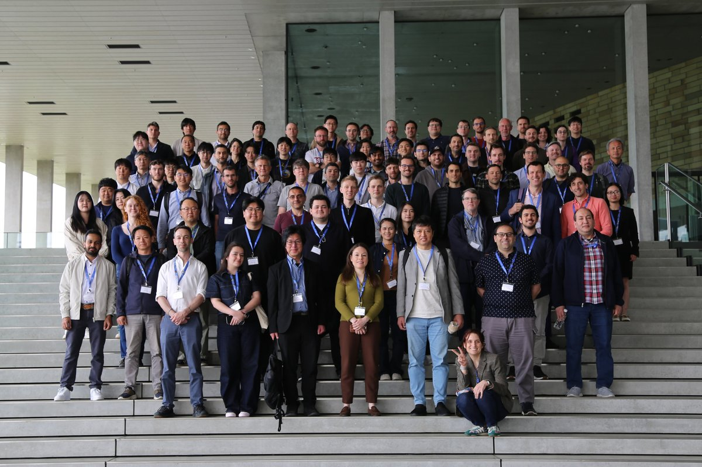

# summary-malapa-2026

Exploring and visualizing the contributions to
[MaLAPA 2026 Japan](https://indico.rcnp.osaka-u.ac.jp/event/2676/).

<p align="center">
  
</p>

This repo takes the talk/poster metadata from the workshop and turns it into a
few plots: which institutions contributed, where in the world they are, and how
institutions collaborated with one another.

## What's in here

Two Jupyter notebooks do the work:

1. **`step_1_prepare_data.ipynb`** — data prep. Inspects the raw JSON
   exported from the Indico event, flags which submissions are posters, attaches
   each author's institution info, prints some summary stats, and writes a
   cleaned‑up `step_1_output/contributions_rewritten.json`.
2. **`step_2_explore_contributions.ipynb`** — the plots. Reads the cleaned data and
   produces the interactive (Plotly) figures:
   - **Contributions by First Speaker Institution** — bar chart
   - **Contributions by Location** — world map of contributing institutions
   - **Institution Collaboration Network** — who co‑authored with whom
     (also grouped by country)

Notebook 2 saves a rendered PNG snapshot of each plot into `step_2_output/`
(checked in), so you can preview them without running anything. See
[**`step_2_output/README.md`**](step_2_output/README.md) for a gallery of the
plots and the institutions-by-community table.

### Folder layout

Data is split into one input folder and one output folder per notebook, so it's
clear what is source material and what each step produces:

- **`source_data/`** — the notebooks' input files, checked in so they run out of
  the box (see [`source_data/README.md`](source_data/README.md) for per-file
  provenance):
  - `contributions.json`, `poster_submission_numbers.json`,
    `manual_to_standard_institutions_dictionary.json` — consumed by `step_1_prepare_data.ipynb`
  - `institution_locations.json` — institutions with latitude/longitude, used
    by the map in `step_2_explore_contributions.ipynb`
  - `group_photo.jpeg` — group photo from the workshop (shown above)
- **`step_1_output/`** — written by notebook 1: `contributions_rewritten.json`
  (the cleaned data that notebook 2 reads) and `institutions_seen.json` (the
  deduplicated institution list used to seed `source_data/institution_locations.json`).
- **`step_2_output/`** — written by notebook 2: a rendered `*.png` snapshot of
  each of the four plots, and `institution_submissions_by_community.txt` (the
  per-community institution listing printed at the end of the notebook).

## Getting started

This project uses [**uv**](https://docs.astral.sh/uv/) to manage Python and its
dependencies. uv is a fast, all‑in‑one replacement for `pip`/`venv` — it reads
`pyproject.toml` + `uv.lock` and builds an exact, reproducible environment for
you, so you don't have to create a virtualenv or `pip install` anything by hand.

### 1. Install uv

macOS / Linux:

```bash
curl -LsSf https://astral.sh/uv/install.sh | sh
```

(macOS users can also use `brew install uv`.) On Windows, see the
[uv install docs](https://docs.astral.sh/uv/getting-started/installation/).

### 2. Set up the environment

From the repo root:

```bash
uv sync
```

This creates a `.venv/` and installs the pinned dependencies (Python 3.11,
JupyterLab, pandas, plotly, networkx, pycountry, …). You don't need to activate
anything — prefix commands with `uv run` and uv uses this environment
automatically.

> **If you'll commit notebook changes:** notebooks are tracked *with* their
> outputs but with volatile metadata (execution counts, cell metadata) stripped,
> via [nbstripout](https://github.com/kynan/nbstripout). The filter lives in
> `.git/config` (not committed), so configure it **once per clone**:
>
> ```bash
> uv run nbstripout --install --keep-output
> git config filter.nbstripout.clean 'uv run --quiet nbstripout --keep-output'
> ```
>
> `--install` alone doesn't reliably keep `--keep-output`, so the explicit
> `git config` line is what preserves cell outputs. See `CLAUDE.md` for details.

### 3. Run it — two ways

**Quick — regenerate all the plots and outputs headlessly:**

```bash
uv run main.py
```

This runs both notebooks in order and writes everything to `step_1_output/` and
`step_2_output/` (the four plot PNGs and the text report) without opening a
browser — handy for reproducing the outputs after a data update.

**Interactive — explore and modify:**

```bash
uv run jupyter lab
```

Opens JupyterLab so you can dig into the notebooks, tweak the analysis, and see
the interactive Plotly figures. Run them in order:

1. **`step_1_prepare_data.ipynb`** first — reads `source_data/` and generates
   `step_1_output/contributions_rewritten.json`.
2. **`step_2_explore_contributions.ipynb`** top to bottom to produce the plots
   (and the PNG + text outputs in `step_2_output/`).

> Prefer VS Code, Cursor, or PyCharm? After `uv sync`, just open a notebook and
> select the `.venv` interpreter as the kernel — no `uv run` needed.
