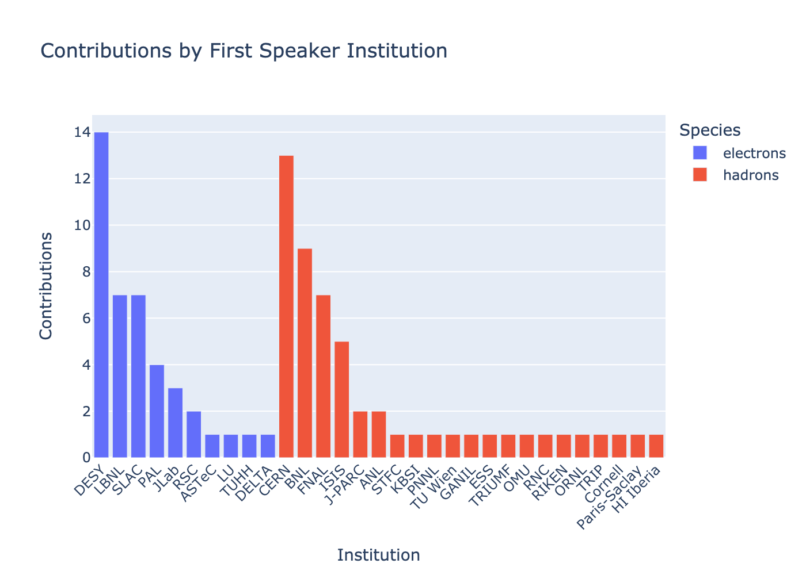
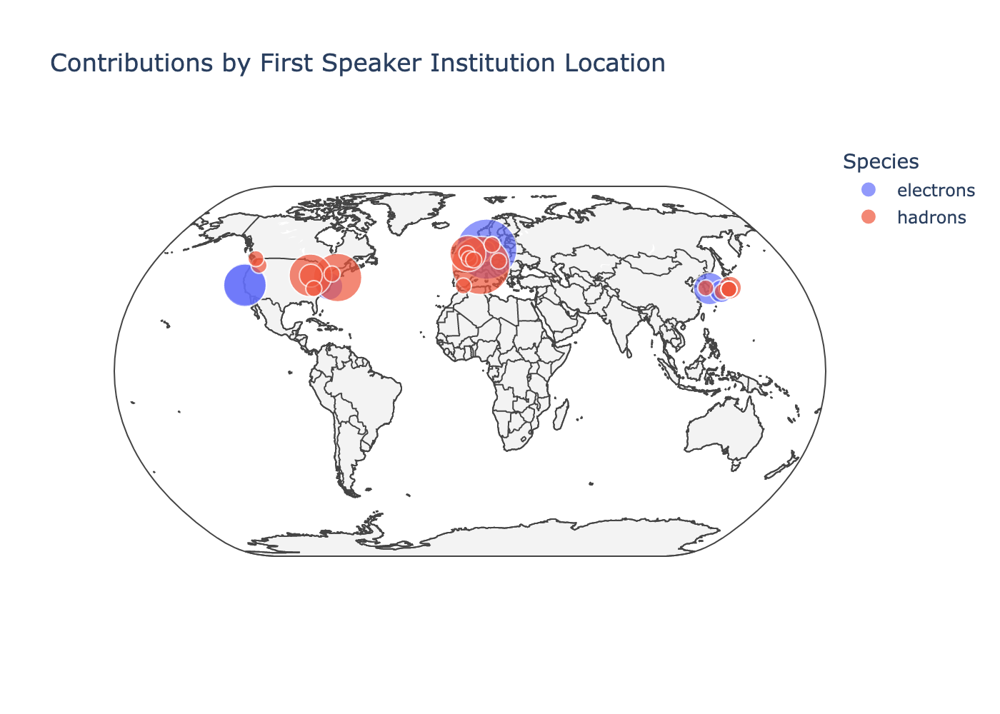
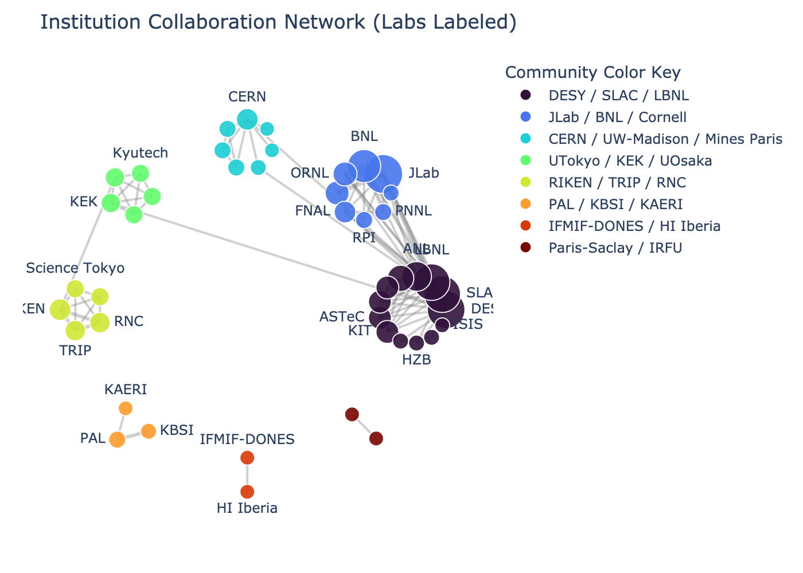
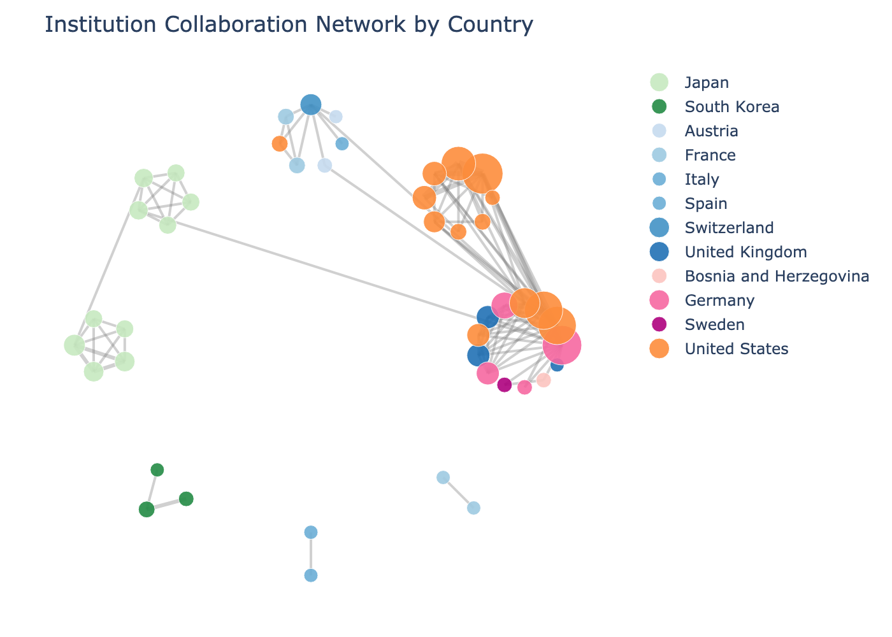

# Step 2 outputs

<!-- AUTO-GENERATED by step_2_explore_contributions.ipynb on every run. -->
<!-- Do not edit by hand. The gallery assumes the .png file names below are -->
<!-- the ones this notebook writes into this directory. -->

Rendered snapshots and the community listing produced by
`step_2_explore_contributions.ipynb`. Regenerate with `uv run main.py` (or by
running the notebook top to bottom).

> **Snapshot of one run.** Community detection is not deterministic, so the
> community numbers/colors may permute if you re-run — the clustering is stable.
>
> **One institution per person.** Where an individual listed more than one
> institution, only one was chosen, so each person counts toward a single
> institution.

## Plots

### Contributions by first-speaker institution

Contributions per institution (attributed to the first speaker), colored by species — electron- vs hadron-machine institutions.

### Contributions by location

The same first-speaker counts placed on a world map; marker size is the number of contributions.

### Institution collaboration network — by community

Institutions are linked whenever they co-appear on a contribution (weighted by how many they share); nodes are colored by detected community.

### Institution collaboration network — by country

The same collaboration network, colored by country instead of community.

## Institutions by community

**Contributions** counts every contribution an institution is credited on (speaker, author, or co-author); **first-speaker submissions** lists the contributions where that institution provided the first speaker (`—` = none).

| Community | Institution | Contributions | First-speaker submissions |
| ---: | --- | ---: | --- |
| 0 | DESY | 17 | 0, 1, 4, 10, 31, 33, 34, 53, 54, 55, 56, 64, 67, 70 |
|  | SLAC | 13 | 3, 12, 51, 57, 58, 61, 93 |
|  | LBNL | 9 | 8, 9, 24, 41, 44, 50, 60 |
|  | ISIS | 5 | 66, 69, 75, 76, 81 |
|  | ANL | 4 | 29, 59 |
|  | TUHH | 4 | 82 |
|  | ASTeC | 2 | 49 |
|  | LU | 2 | 26 |
|  | KIT | 1 | — |
|  | UChicago | 1 | — |
|  | UoL | 1 | — |
|  | HZB | 1 | — |
|  | UniSarajevo | 1 | — |
| 1 | BNL | 11 | 2, 11, 25, 30, 36, 40, 43, 72, 73 |
|  | JLab | 10 | 27, 32, 35 |
|  | FNAL | 9 | 47, 48, 79, 80, 85, 89, 91 |
|  | Cornell | 6 | 7 |
|  | ORNL | 3 | 28 |
|  | PNNL | 2 | 90 |
|  | RPI | 1 | — |
|  | UH | 1 | — |
| 2 | CERN | 14 | 13, 14, 16, 17, 18, 20, 21, 37, 38, 39, 42, 46, 88 |
|  | EFEI | 1 | — |
|  | Mines Paris | 1 | — |
|  | UW-Madison | 1 | — |
|  | TU Wien | 1 | 19 |
|  | UniVienna | 1 | — |
|  | UniNa | 1 | — |
| 3 | KEK | 2 | — |
|  | UTokyo | 2 | — |
|  | Kyutech | 1 | — |
|  | OMU | 1 | 77 |
|  | UOsaka | 1 | — |
| 4 | RIKEN | 3 | 45 |
|  | RNC | 2 | 83 |
|  | TRIP | 2 | 68 |
|  | Science Tokyo | 1 | — |
|  | Tohoku | 1 | — |
| 5 | PAL | 4 | 62, 63, 78, 86 |
|  | KBSI | 3 | 74 |
|  | KAERI | 1 | — |
| 6 | HI Iberia | 1 | 15 |
|  | IFMIF-DONES | 1 | — |
| 7 | IRFU | 1 | — |
|  | Paris-Saclay | 1 | 65 |
